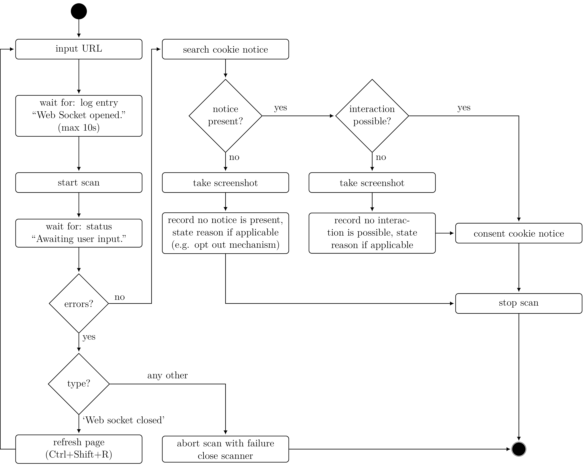

## Evaluation: Third Party Tracking auf .de domains

Analyse von `.de` domains auf Tracking Eigenschaften vor und nach Einwilligung des Consent Banners.

### Auswahl Seiten
Zufällige Auswahl von 200 domains der [tranco-list](https://tranco-list.eu/) innerhalb der Top 1000 `.de` domains.

### Vorgehen Scanner (im Hintergrund)
Beim Besuch der Seite werden gesetzte Cookies, third party requests sowie JavaScript Funktionsaufrufe aufgezeichnet.
Gespeichert werden Cookies, requests, responses und Funktionsaufrufe jeweils vor und nach der Einwilligung des Banners, sofern dieser vorhanden ist.
Das eventuelle Fehlen des Banners wird als Notiz vermerkt.

### Datenerhebung

Das Tool untersucht Webseiten nach Trackingeigenschaften. In der Datenerhebung werden 200 zufällig gewählte .de Seiten untersucht.

Stand: https://psi.secpad.de/p/endress-klickstudie

Vorgehen:
1. URL aus Liste auswählen
2. Starte Scan (Websocket muss verbunden sein).
3. Warte, bis Interaktion mit Seite möglich ist.
4. Suche Nach Cookie Notice.
    1. sofern vorhanden: untersuche ob es ein Modal ist (Interaktion möglich) -> Screenshot falls Interaktion nicht möglich, Einwilligung aller Cookies
    2. wenn nicht vorhanden -> Screenshot.
5. Scan beenden

Hinweise:
- Falls kritische Fehler auftreten: Seite neu Laden und Scan einmal erneut probieren. Falls es dann immernoch nicht klappt, Seite vermerken und weiter mit nächster Seite.
- Das Tool hat noch ein Paar bugs, z.B. dauert das Verbinden mit dem Websocket manchmal etwas (bis zu 10s). Es liegt an Caching, nicht an eurem Browser.

Die Datenerhebung wird in folgendem Aktivitätsdiagramm zusammengefasst:

### Auswertung

Die Auswertung ist in Teilen eine Replikation des [ConsentGuard](https://gitlab.com/papamano/consent-guard/) Paper von Papadogiannakis und anderen (2021).

Sie soll folgende Fragen beantworten:
- Welche der third party requests sowie der gesetzten Cookies vor (bzw. nach) Nutzer Einwilligung sind tracker (tracking Kontext)?
  - Welche requests kamen erst nach der Einwilligung hinzu?
- Gibt es einen Cookie Banner? (Modal)
- Gibt es vor Einwilligung tracking ID leaks? 
- Gibt es vor Einwilligung bereits Funktionsaufrufe die im Tracking Kontext stehen? (vielleicht out of scope?)

Für die Klassifizierung der Requests und Cookies wird [adblockeval](https://github.com/hprid/adblockeval) mithilfe der Tracking Datenbanken EasyList und EasyPrivacy verwendet.
Die tracking ID leaks werden anhand des Request logs ausgewertet (vgl. [leaks.js](https://gitlab.com/papamano/consent-guard/-/blob/main/Source/Detector/detectors/leaks.js)).
Der log der Funktionsaufrufe wird mit bekannten tracking Funktionen verglichen (vgl. [fingerprinting.js](https://gitlab.com/papamano/consent-guard/-/blob/main/Source/Detector/detectors/fingerprinting.js)).

